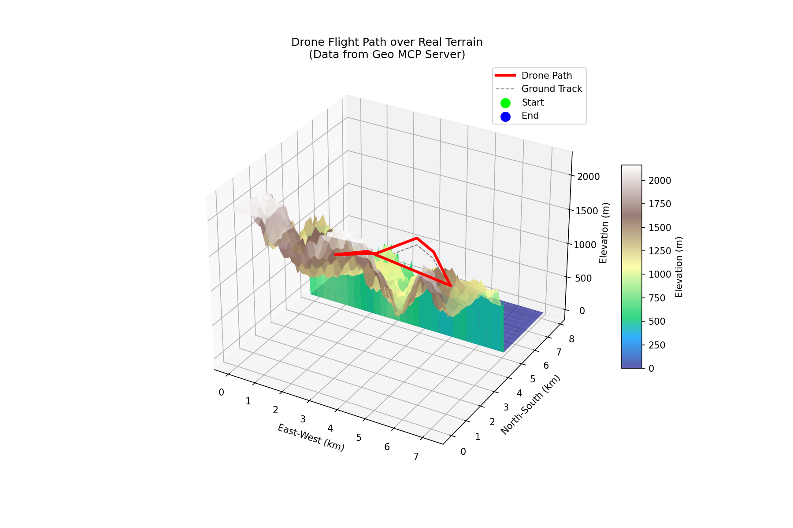

# 🌍 Geospatial MCP Server & AI Assistant

**Author:** Glenn Mossy  
**License:** MIT

A powerful **Model Context Protocol (MCP)** server designed for advanced geospatial analysis, 3D terrain visualization, and autonomous drone mission planning. This project integrates real-time geospatial tools with an AI Assistant powered by open-source LLMs.


*(Above: 3D Visualization of a Drone Flight Path over Terrain)*

## ✨ Key Features

### 🎮 Mission Control Center
*   **Autonomous Mission Planning**: Select from pre-defined scenarios like "Rim Survey", "Grand Canyon Tour", and "River Run".
*   **Safety Analysis**: Automatically calculates route distance, checks for terrain collisions, and verifies safe altitude margins.
*   **Line of Sight (LOS)**: Simulates connectivity from Comms Towers and visibility from Observation Posts.
*   **3D Visualization**: Interactive 3D plots of the drone's flight path relative to the terrain.

### 🤖 AI Geospatial Assistant
*   **Natural Language Interface**: Chat with your geospatial data using models like `Qwen/Qwen2.5-72B-Instruct` (via Hugging Face).
*   **Tool Use**: The AI can autonomously call tools to answer complex questions:
    *   *"Can a tower at A see a rover at B?"*
    *   *"Generate a heatmap for this area."*
    *   *"Plan a route from X to Y."*
*   **Visual Responses**: The assistant can generate and display terrain heatmaps directly in the chat.

### 🛠️ Geospatial Tool Suite
*   **Elevation**: Query high-resolution elevation data (DTED/SRTM) for any coordinate.
*   **Line of Sight**: Calculate visibility between any two points on the globe.
*   **Heatmaps**: Render visual elevation gradients for situational awareness.
*   **Distance & MGRS**: Utilities for distance calculation and coordinate conversion (Lat/Lon <-> MGRS).

## 🚀 Getting Started

### Prerequisites
*   **Docker** (Recommended) OR Python 3.11+
*   **Hugging Face API Token** (Free) for the AI Assistant.

### Quick Start (Docker)

1.  **Clone the Repository**:
    ```bash
    git clone https://github.com/gmossy/geo-mcp-server.git
    cd geo-mcp-server
    ```

2.  **Configure Environment**:
    Create a `.env` file in the root directory:
    ```bash
    HF_TOKEN=hf_YourHuggingFaceTokenHere
    ```

3.  **Build and Run**:
    ```bash
    make build
    make run
    ```

4.  **Access the Dashboard**:
    Open [http://localhost:7860](http://localhost:7860) in your browser.

### Local Development

1.  **Install Dependencies**:
    ```bash
    pip install -r requirements.txt
    ```

2.  **Run Server**:
    ```bash
    ./start.sh
    ```

## 📂 Project Structure

*   `gradio_dashboard.py`: The main UI application (Gradio) featuring the Dashboard, AI Assistant, and Mission Control.
*   `server.py`: The core FastAPI server implementing the MCP protocol and geospatial logic.
*   `bridge.py`: An adapter to connect this server to **Claude Desktop** or other MCP clients.
*   `dted/`: Directory for storing elevation data tiles (DTED/SRTM).
*   `sample_routes/`: GeoJSON files defining mission paths.
*   `scripts/`: Helper utilities for data downloading and testing.

## 🔌 Connecting to Claude Desktop

You can use this server as a tool provider for Claude Desktop.

1.  Ensure the server is running.
2.  Configure Claude Desktop to use `bridge.py`:
    ```json
    "geo-server": {
      "command": "python",
      "args": ["/absolute/path/to/geo-mcp-server/bridge.py"]
    }
    ```

## 📸 Screenshots

### Mission Control
*(Placeholder: Screenshot of the Mission Control tab showing the 3D plot and analysis report)*

### AI Assistant
*(Placeholder: Screenshot of the AI Assistant generating a heatmap)*

## 📄 License

This project is licensed under the MIT License - see the [LICENSE](LICENSE) file for details.

---
*Created by Glenn Mossy*
